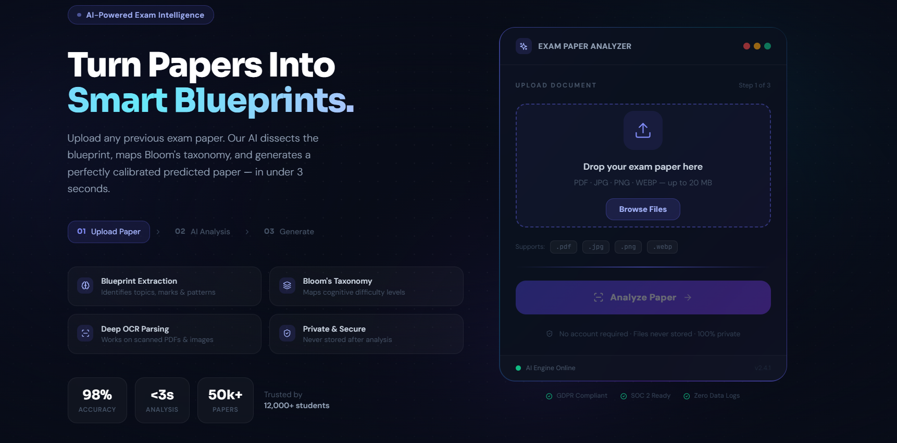
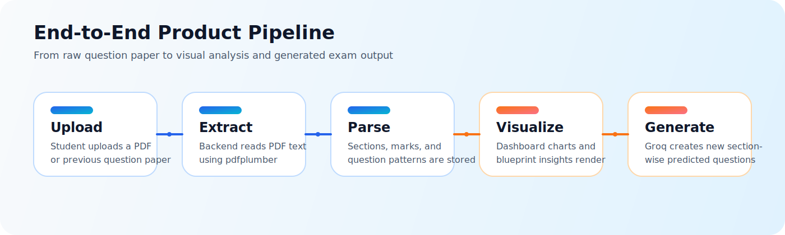
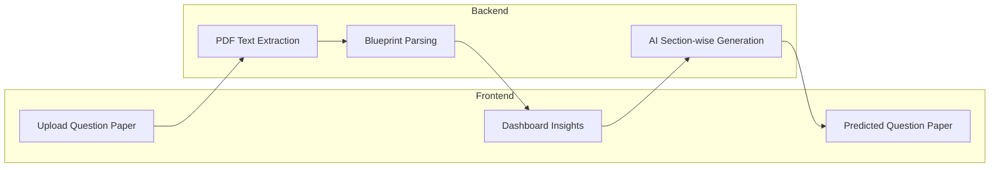

# AI Exam Generator

<div align="center">
  
</div>

<div align="center">

  [](https://git.io/typing-svg)

  
  
  
  
  

</div>

<p align="center">
  AI Exam Generator turns old question papers into structured blueprints, visual insights, and AI-generated predicted papers that stay aligned with the uploaded exam pattern.
</p>

---

## Why this project stands out

This project is built for students and educators who want more than OCR and more than a generic prompt box. The app analyzes a real question paper, extracts section-wise structure, visualizes the pattern on a dashboard, and generates a new paper based on the same blueprint.

### What it does

- Uploads previous exam papers from the frontend and sends them to a FastAPI backend
- Extracts text from PDFs and builds a blueprint of sections, questions, and marks
- Shows analytics on the dashboard with cards, tables, and charts
- Generates a predicted paper section by section using Groq
- Preserves the uploaded paper context instead of generating random unrelated questions

---

## Visual Overview

<div align="center">
  
</div>

### Experience flow



---

## Feature Highlights

| Feature | What it delivers |
| --- | --- |
| Smart upload flow | Accepts exam papers and pushes them through backend extraction |
| Blueprint analysis | Breaks papers into sections, question counts, marks, and structure |
| Visual dashboard | Displays key insights, blueprint rows, and charts in a polished UI |
| AI paper generation | Produces section-wise predicted questions from the uploaded context |
| Clean API contract | Frontend stores parsed blueprint JSON and generated paper data |
| Extensible architecture | Easy to improve extraction, prompts, charts, and export features |

---

## Demo Moments

These sections are designed to feel lively on GitHub using animated SVG plus bold graphics.

<div align="center">
  
</div>

### Suggested GIF slots

If you want to make the README even more premium later, add screen-recording GIFs here:

- `assets/readme/upload-demo.gif` for the upload and analysis flow
- `assets/readme/dashboard-demo.gif` for the insights and chart interactions
- `assets/readme/generation-demo.gif` for predicted paper generation

You can then embed them with:

```md


```

---

## Tech Stack

### Frontend

- Next.js 14
- React 18
- TypeScript
- Tailwind CSS
- Framer Motion
- Recharts
- Lucide React
- Sonner

### Backend

- FastAPI
- Uvicorn
- pdfplumber
- python-multipart
- Groq API
- Regex-based blueprint extraction

---

## Project Structure

```text
AI-exam-generator/
|-- client/
|   |-- app/
|   |   |-- page.tsx
|   |   |-- dashboard/page.tsx
|   |   `-- paper/page.tsx
|   |-- components/
|   `-- lib/
|-- server/
|   |-- app/
|   |   |-- routes/
|   |   `-- services/
|   `-- uploads/
`-- assets/
    `-- readme/
```

---

## Local Setup

### 1. Clone the project

```bash
git clone <your-repo-url>
cd AI-exam-generator
```

### 2. Start the frontend

```bash
cd client
npm install
npm run dev
```

Frontend runs on `http://localhost:3000`

### 3. Start the backend

```bash
cd server
pip install -r requirements.txt
uvicorn app.main:app --reload
```

Backend runs on `http://127.0.0.1:8000`

### 4. Environment variables

Create or update `server/.env`:

```env
GROQ_API_KEY=your_groq_api_key
GROQ_MODEL=llama-3.1-8b-instant
```

Optional frontend override in `client/.env.local`:

```env
NEXT_PUBLIC_API_URL=http://127.0.0.1:8000
```

---

## API Flow

### Upload route

- `POST /upload/`
- Saves the file
- Extracts PDF text
- Parses blueprint JSON
- Returns preview plus blueprint data

### Generate route

- `POST /generate/`
- Accepts blueprint JSON
- Generates section-wise questions
- Returns `generated_paper`

---

## Current Workflow

1. User uploads a previous exam paper
2. Backend extracts and parses section/question data
3. Frontend stores the blueprint in local storage
4. Dashboard renders insights from the extracted JSON
5. User clicks generate
6. Backend generates a predicted paper using the uploaded paper as context
7. Frontend shows the generated result on the paper page

---

## Design Notes

- The UI uses animated onboarding, rich gradients, and a modern dashboard layout
- The README mirrors that same vibe with SVG graphics, animated headers, and flow visuals
- The architecture is intentionally split so extraction, analysis, and generation can evolve independently

---

## Future Improvements

- Add OCR fallback for scanned image-based papers
- Add PDF export for generated papers
- Improve blueprint extraction for complex university formats
- Add subject detection and metadata tags
- Store paper history in a database
- Add authentication and multi-user dashboards

---

## Built For

This project is a strong base for:

- Student productivity tools
- EdTech hackathons
- AI document intelligence demos
- Academic automation products
- Portfolio projects with real frontend plus backend integration

---

## Credits

Built with Next.js, FastAPI, Groq, Tailwind CSS, Framer Motion, and a lot of curiosity about how exam patterns can be turned into usable intelligence.
